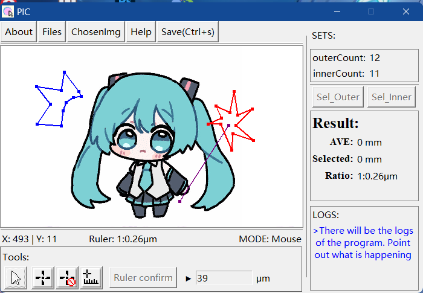

<h1>PIC</h1>
A small tool for easily calculating the thickness of the cross-section of the pulmonary blood vessels

<a href="https://github.com/Data708983/PIC/blob/master/resource/Help.html">how to use?</a>
